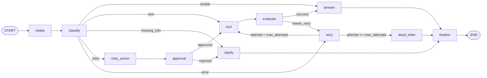

# Day 08 Lab Report

## 1. Thông Tin Nhóm

- Ngày báo cáo: 2026-08-25
- Repo/commit: source mới nhất tại thời điểm kiểm thử

| Thành viên | MSSV |
| --- | --- |
| Phạm Minh Hiếu | 2A202601562 |
| Phạm Công Đăng | 2A202601280 |
| Nguyễn Thị Thu Trang | 2A202601172 |
| Trương Minh Tâm | 2A202602005 |
| Trần Minh Hiển | 2A202601812 |

## 2. Kiến Trúc Hệ Thống

Hệ thống được xây dựng bằng `StateGraph(AgentState)` gồm 11 node:

`intake`, `classify`, `tool`, `evaluate`, `answer`, `clarify`, `risky_action`, `approval`, `retry`, `dead_letter`, `finalize`.

Luồng xử lý chính:



`classify` là node quyết định route ban đầu. Các route có rủi ro đi qua `risky_action -> approval` trước khi gọi tool. Vòng lặp `tool -> evaluate -> retry -> tool` được giới hạn bằng `max_attempts`, giúp tránh lặp vô hạn. Mọi nhánh đều kết thúc tại `finalize -> END` để ghi lại audit trail.

## 3. State Schema Và Reducer

State dùng `AgentState` dạng TypedDict, gọn và có thể serialize qua checkpointer.

| Field | Reducer | Mục đích |
| --- | --- | --- |
| `route` | overwrite | Route hiện tại do `classify_node` sinh ra. |
| `risk_level` | overwrite | Mức rủi ro của yêu cầu. |
| `attempt`, `max_attempts` | overwrite | Điều khiển số lần retry. |
| `evaluation_result` | overwrite | Kết quả đánh giá tool: `success` hoặc `needs_retry`. |
| `pending_question` | overwrite | Câu hỏi cần làm rõ với người dùng. |
| `proposed_action` | overwrite | Hành động rủi ro đang chờ phê duyệt. |
| `approval` | overwrite | Quyết định phê duyệt ở dạng plain `dict`. |
| `final_answer` | overwrite | Câu trả lời cuối cùng. |
| `messages` | append | Lịch sử hội thoại/audit. |
| `tool_results` | append | Kết quả mỗi lần gọi tool. |
| `errors` | append | Lỗi hoặc retry được ghi nhận. |
| `events` | append | Sự kiện từng node, dùng để tính metrics. |

Với các field append-only, node chỉ trả về item mới, ví dụ `{"tool_results": [x]}`. Không trả lại toàn bộ list cũ để tránh nhân đôi dữ liệu.

## 4. Kết Quả Kiểm Thử

Lệnh đã chạy:

```bash
make test
set -a; source .env; set +a; LLM_MODEL=gemini-3.6-flash make run-scenarios
set -a; source .env; set +a; LLM_MODEL=gemini-3.6-flash make grade-local
```

Kết quả:

- Unit test: `19 passed, 6 skipped`
- Metrics validation: `Metrics valid. success_rate=100.00%`
- LLM dùng khi kiểm thử: `gemini-3.6-flash`

| Metric | Value |
| --- | ---: |
| total_scenarios | 12 |
| success_rate | 100.0% |
| avg_nodes_visited | 6.42 |
| total_retries | 5 |
| total_interrupts | 3 |
| resume_success | false |

| Scenario | Expected route | Actual route | Success | Nodes visited | Retries | Interrupts |
| --- | --- | --- | :---: | ---: | ---: | ---: |
| S01_simple | simple | simple | Yes | 4 | 0 | 0 |
| S02_tool | tool | tool | Yes | 6 | 0 | 0 |
| S03_missing | missing_info | missing_info | Yes | 4 | 0 | 0 |
| S04_risky | risky | risky | Yes | 8 | 0 | 1 |
| S05_error | error | error | Yes | 10 | 2 | 0 |
| S06_delete | risky | risky | Yes | 8 | 0 | 1 |
| S07_dead_letter | error | error | Yes | 5 | 1 | 0 |
| S08_cancel | risky | risky | Yes | 8 | 0 | 1 |
| S09_track | tool | tool | Yes | 6 | 0 | 0 |
| S10_broken | missing_info | missing_info | Yes | 4 | 0 | 0 |
| S11_unavailable | error | error | Yes | 10 | 2 | 0 |
| S12_policy | simple | simple | Yes | 4 | 0 | 0 |

Nhận xét:

- Tất cả 12 scenario đều đúng route kỳ vọng.
- Ba scenario rủi ro `S04`, `S06`, `S08` đều đi qua approval, đạt yêu cầu HITL.
- `S05` và `S11` retry 2 lần rồi thành công.
- `S07` đạt giới hạn retry và đi vào `dead_letter` đúng thiết kế.

## 5. Phân Tích Lỗi Và Khả Năng Chịu Lỗi

**Lỗi LLM/model không khả dụng.** Nếu LLM lỗi, `classify_node` bắt exception, ghi vào `errors` và fallback về route `simple` để graph không crash. Trong quá trình kiểm thử, model mặc định `gemini-2.5-flash` bị API trả 404 vì không còn khả dụng cho user mới. Cách khắc phục là chạy với `LLM_MODEL=gemini-3.6-flash`.

**Retry bị giới hạn.** Với route `error`, tool có thể trả về lỗi tạm thời. `evaluate_node` đánh dấu `needs_retry`, sau đó `retry` tăng `attempt`. Nếu `attempt < max_attempts`, graph gọi lại tool; nếu vượt giới hạn, graph đi đến `dead_letter`. Cơ chế này tránh lặp vô hạn và vẫn ghi rõ lỗi trong audit trail.

## 6. Persistence Và Recovery

`persistence.py` hỗ trợ SQLite checkpointer bằng `SqliteSaver`, kết hợp `sqlite3.connect(..., check_same_thread=False)` và `PRAGMA journal_mode=WAL`.

Bằng chứng recovery đã được kiểm tra bằng:

```bash
set -a; source .env; set +a; python scripts/test_persistence_resume.py
```

Kết quả trong `reports/persistence_resume_evidence.log`:

```text
invoke() final state: attempt=3, events=3
[process 1] len(list(graph.get_state_history(config))) = 5
[process 2] resumed state.values = {'attempt': 3, ...}
[process 2] len(list(graph.get_state_history(config))) = 5
PASS: sqlite checkpoint survives a fresh process re-opening the same db file.
```

Điều này chứng minh checkpoint được lưu bền vững trong SQLite và có thể đọc lại sau khi mở process mới. Trường `resume_success` trong `outputs/metrics.json` vẫn là `false` vì phần kiểm tra resume hiện đang nằm ở script riêng, chưa được tích hợp vào scenario runner.

## 7. Phần Mở Rộng Đã Thực Hiện

- Tích hợp LLM cho `classify_node` bằng structured output.
- Tích hợp LLM cho `answer_node` để trả lời dựa trên context/tool result.
- Có HITL approval cho route rủi ro.
- Có bounded retry và dead-letter path.
- Có SQLite persistence và log recovery riêng.

## 8. Hướng Cải Tiến

1. Cập nhật model mặc định từ `gemini-2.5-flash` sang model còn khả dụng, ví dụ `gemini-3.6-flash`.
2. Tích hợp kết quả `scripts/test_persistence_resume.py` vào scenario runner để `resume_success=True` khi recovery pass.
3. Thêm fake/recorded LLM cho CI để test không phụ thuộc API key và quota.
4. Thêm retry/backoff riêng cho lỗi LLM tạm thời như 429 hoặc 5xx.
